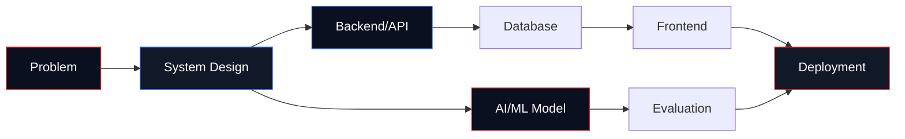

<div align="center">
  
</div>

<div align="center">
  
</div>

<br/>

<table>
<tr>
<td width="62%" valign="top">

### Hello, I am Philip.

I work where **software engineering**, **AI/ML**, and **teaching** meet. My day-to-day focus is building useful systems: reliable APIs, data-backed web apps, learning platforms, and machine-learning workflows that can move from notebook to real-world use.

My research track is **Swahili Image Caption Generation using Deep Learning for low-resource languages**. That keeps me close to Computer Vision, NLP, accessibility, and the practical challenge of building AI for African language contexts.

</td>
<td width="38%" valign="top">

```txt
profile.status     active
base.location      Kenya
current.role       Lecturer + Builder
engineering.mode   backend-first
research.mode      AI/ML applied
favorite.stack     Python + FastAPI
next.target        production ML
```

</td>
</tr>
</table>

<p align="center">
  <a href="https://github.com/meenphilip">
    
  </a>
  <a href="https://www.linkedin.com/in/philip-meen/">
    
  </a>
  
  
</p>

---

## Build Coordinates



| Track | What I do | Tools I reach for |
|---|---|---|
| Backend engineering | APIs, authentication, ERP workflows, business platforms | Python, Django, FastAPI, PostgreSQL |
| Frontend engineering | Dashboards, admin tools, responsive web apps | React, Next.js, JavaScript, TypeScript |
| AI & ML engineering | Image captioning, model experiments, NLP/CV workflows | Python, deep learning, ML evaluation |
| Teaching | Programming, databases, web development, software engineering | C, Python, HTML/CSS/JS, SQL |

---

## Lab Notes

> I am especially interested in systems that are technically solid and locally useful: software that handles real workflows, AI that respects language context, and teaching that turns theory into working code.

```txt
research.question
  How can deep learning improve Swahili image captioning for low-resource language settings?

engineering.question
  How do we make the result usable as a dependable software system?

teaching.question
  How do we explain the same ideas clearly enough for learners to build with them?
```

---

## Toolkit

<table>
<tr>
<td valign="top" width="33%">

**Core**


</td>
<td valign="top" width="33%">

**Application**


</td>
<td valign="top" width="33%">

**Data + Ops**


</td>
</tr>
</table>

---

## Selected Work

<table>
<tr>
<td width="50%" valign="top">

### [fastracker](https://github.com/meenphilip/fastracker)
Python backend work for tracking application logic and practical workflows.

`Python` `Backend` `Workflow Logic`

</td>
<td width="50%" valign="top">

### [educa](https://github.com/meenphilip/educa)
E-learning platform work tied to my teaching and learning-systems interests.

`Python` `Django` `Education Technology`

</td>
</tr>
<tr>
<td width="50%" valign="top">

### [fastapi_demo](https://github.com/meenphilip/fastapi_demo)
API practice around modern backend service patterns and integrations.

`FastAPI` `JavaScript` `REST APIs`

</td>
<td width="50%" valign="top">

### [Assignment-Logistic-Regression](https://github.com/meenphilip/Assignment-Logistic-Regression)
Machine-learning coursework and experimentation around logistic regression.

`Jupyter Notebook` `Machine Learning` `Modeling`

</td>
</tr>
<tr>
<td width="50%" valign="top">

### [labourlinks](https://github.com/meenphilip/labourlinks)
Job listing website focused on manual worker employment discovery.

`HTML` `Web App` `Job Listings`

</td>
<td width="50%" valign="top">

### [Authify](https://github.com/meenphilip/Authify)
Django authentication system exploring user accounts and secure access flows.

`Django` `Authentication` `CSS`

</td>
</tr>
</table>

---

## Signal

<div align="center">
  
  
</div>

<br/>

<div align="center">
  
</div>

---

## Current Direction

```txt
building     cleaner backend systems and full-stack tools
researching  Swahili image captioning for low-resource AI
teaching     programming, databases, web development, software engineering
learning     production-grade AI/ML engineering workflows
```

<p align="center">
  <a href="https://www.linkedin.com/in/philip-meen/">
    
  </a>
  <a href="https://github.com/meenphilip">
    
  </a>
</p>

<div align="center">
  
</div>
